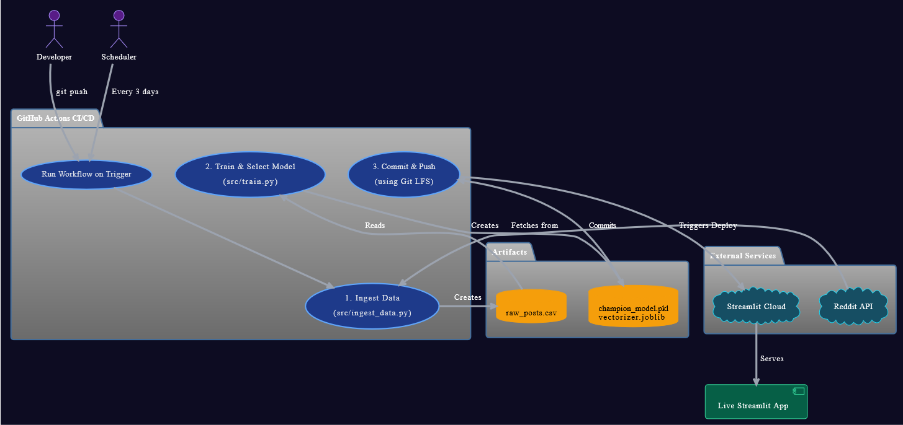

# AI Content Classifier: Production MLOps Pipeline

[](https://github.com/RobinMillford/Reddit-content-classifier/actions/workflows/main.yml)
[](https://www.python.org/downloads/)
[](https://streamlit.io/)
[](https://github.com/RobinMillford/Reddit-content-classifier)

A production-ready MLOps pipeline that automatically classifies Reddit content using advanced multi-label machine learning with enterprise-level automation and continuous learning.

🌐 **[Live Application](https://reddit-content-classifier.streamlit.app/)**

## 🎯 Project Overview

- **Multi-Label Classification**: Simultaneous analysis across 5 dimensions (Safety, Toxicity, Sentiment, Topic, Engagement)
- **Automated MLOps**: Weekly retraining with model selection and deployment
- **Production Scaling**: Handles 25,000+ posts per training cycle
- **Real-time Inference**: Sub-second response times with 88%+ accuracy

## 📊 Multi-Label Classification

| Category       | Description                | Classifications                      |
| -------------- | -------------------------- | ------------------------------------ |
| **Safety**     | Content safety assessment  | Safe, NSFW                           |
| **Toxicity**   | Harmful content detection  | Non-toxic, Toxic                     |
| **Sentiment**  | Emotional tone analysis    | Positive, Neutral, Negative          |
| **Topic**      | Content categorization     | Technology, Gaming, Business, Health |
| **Engagement** | Viral potential prediction | High, Low Engagement                 |

## 🏗️ Architecture



```
Reddit API → Data Pipeline → ML Training → Model Deployment → Web Application
    │              │              │               │                │
 PRAW API       GitHub Actions   Ensemble ML      Git LFS        Streamlit
```

**MLOps Pipeline**:

1. **Data Collection**: Weekly automated Reddit data ingestion (25,000+ posts)
2. **Feature Engineering**: TF-IDF vectorization (10k features, 1-2 grams)
3. **Model Training**: Multi-algorithm competition (Logistic Regression, SVM, Neural Networks, LightGBM)
4. **Model Selection**: Ensemble creation from top-performing models
5. **Deployment**: Automated Git LFS versioning and cloud deployment

## 🎯 Performance Metrics

| Metric                  | Value   | Description                        |
| ----------------------- | ------- | ---------------------------------- |
| **Binary F1-Score**     | 88.3%   | SFW/NSFW classification accuracy   |
| **Multi-Label Jaccard** | 82.7%   | Overall multi-category performance |
| **Training Data**       | 25,000+ | Reddit posts per training cycle    |
| **Inference Speed**     | <100ms  | Real-time response capability      |
| **Model Size**          | ~150MB  | Optimized for cloud deployment     |
| **Automation**          | Weekly  | Continuous learning and updates    |

## 🛠️ Technology Stack

**Core Technologies**:

- **Python 3.11**, Scikit-learn, LightGBM, Pandas, NumPy
- **Streamlit**, Plotly (Visualization)
- **PRAW** (Reddit API), TF-IDF (NLP)

**MLOps & Infrastructure**:

- **GitHub Actions** (CI/CD), **Git LFS** (Model Versioning)
- **Docker** (Containerization), **Streamlit Cloud** (Deployment)

## 🚀 Local Development Setup

### Prerequisites

- **Python 3.11+**
- **Git** with **Git LFS** support
- **Reddit API credentials** (for data collection and training)

### Step 1: Clone Repository

```bash
git clone https://github.com/RobinMillford/Reddit-content-classifier.git
cd Reddit-content-classifier

# Setup Git LFS for model files
git lfs install
git lfs pull
```

### Step 2: Environment Setup

```bash
# Create virtual environment
python -m venv venv

# Activate virtual environment
# Windows:
venv\Scripts\activate
# macOS/Linux:
source venv/bin/activate

# Install dependencies
pip install -r requirements.txt
```

### Step 3: Reddit API Configuration

**Get Reddit API Credentials**:

1. Go to [Reddit App Preferences](https://www.reddit.com/prefs/apps)
2. Click **"Create App"** or **"Create Another App"**
3. Fill in the form:
   - **Name**: Your app name (e.g., "Content Classifier")
   - **App type**: Select **"script"**
   - **Description**: Optional
   - **About URL**: Leave blank
   - **Redirect URI**: `http://localhost:8080`
4. Click **"Create app"**
5. Note down the **Client ID** (under app name) and **Client Secret**

**Setup Environment Variables**:

Create a `.env` file in the project root:

```bash
# Create .env file
touch .env  # Linux/macOS
# or create manually on Windows
```

Add your Reddit API credentials to `.env`:

```env
REDDIT_CLIENT_ID=your_client_id_here
REDDIT_CLIENT_SECRET=your_client_secret_here
REDDIT_USER_AGENT=YourAppName/1.0
```

**Alternative: Export Environment Variables**:

```bash
# Export variables (Linux/macOS)
export REDDIT_CLIENT_ID="your_client_id"
export REDDIT_CLIENT_SECRET="your_client_secret"
export REDDIT_USER_AGENT="YourAppName/1.0"

# Windows Command Prompt
set REDDIT_CLIENT_ID=your_client_id
set REDDIT_CLIENT_SECRET=your_client_secret
set REDDIT_USER_AGENT=YourAppName/1.0

# Windows PowerShell
$env:REDDIT_CLIENT_ID="your_client_id"
$env:REDDIT_CLIENT_SECRET="your_client_secret"
$env:REDDIT_USER_AGENT="YourAppName/1.0"
```

### Step 4: Run Application

```bash
# Start the web application
streamlit run app.py
```

🌐 **Access**: Application runs at `http://localhost:8501`

### Step 5: Custom Model Training (Optional)

```bash
# Collect fresh training data
python src/ingest_data.py

# Train and evaluate models
python src/train.py

# Models are automatically saved and can be loaded by app.py
```

### Troubleshooting

**Common Issues**:

1. **Git LFS files not downloading**: Run `git lfs pull`
2. **Reddit API errors**: Verify your `.env` credentials
3. **Model files missing**: Ensure Git LFS is installed and configured
4. **Import errors**: Check virtual environment activation

**Verify Setup**:

```bash
# Check Git LFS status
git lfs ls-files

# Verify environment variables
python -c "import os; print(os.getenv('REDDIT_CLIENT_ID'))"

# Test Reddit API connection
python -c "import praw; reddit = praw.Reddit(client_id='test', client_secret='test', user_agent='test'); print('PRAW imported successfully')"
```

## 📁 Project Structure

```
├── src/
│   ├── ingest_data.py      # Reddit data collection
│   └── train.py            # ML model training
├── .github/workflows/      # CI/CD automation
├── app.py                  # Streamlit web application
├── champion_model.pkl      # Production binary model (Git LFS)
├── multi_label_model.pkl   # Production multi-label model (Git LFS)
├── vectorizer.joblib       # Text preprocessing pipeline (Git LFS)
└── model_metadata.joblib   # Model performance metrics (Git LFS)
```

## 💼 Professional Impact

**Business Value**: Demonstrates end-to-end ML engineering capabilities with production-ready automation and scalable infrastructure design.

**Technical Expertise**: Showcases expertise in MLOps, automated pipelines, multi-label classification, and cloud deployment strategies.

**Results Delivered**: 88%+ accuracy system processing 25,000+ posts weekly with zero-downtime continuous deployment.

## 🤝 Contributing

This project is **open source** and welcomes contributions from the community.

**How to Contribute**:

1. Fork the repository
2. Create a feature branch: `git checkout -b feature/enhancement`
3. Make your changes with proper testing
4. Submit a pull request with detailed description

**Areas for Contribution**:

- Model performance improvements
- New classification categories
- Enhanced MLOps automation
- Documentation and testing

**Development Setup**:

```bash
git clone https://github.com/RobinMillford/Reddit-content-classifier.git
cd Reddit-content-classifier
pip install -r requirements.txt
streamlit run app.py
```

**Project Repository**: [github.com/RobinMillford/Reddit-content-classifier](https://github.com/RobinMillford/Reddit-content-classifier)

---

_This project demonstrates production-ready MLOps implementation suitable for enterprise content moderation systems._
